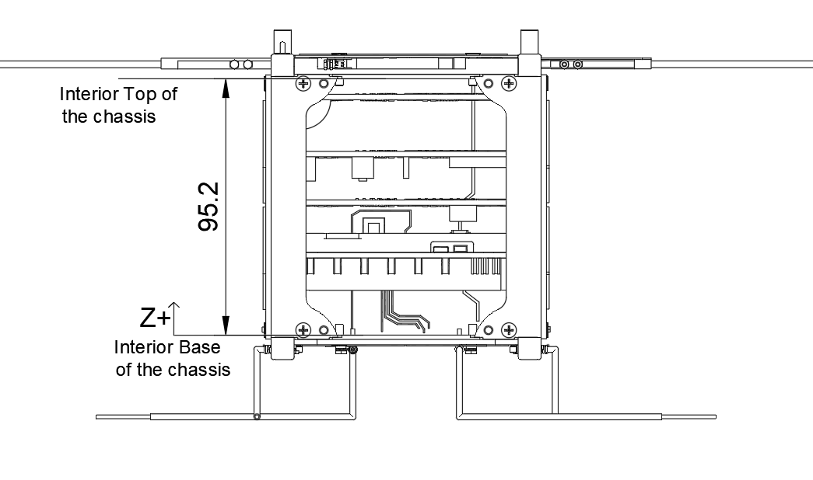

Copy the complete text below into the repository’s `README.md` file.

# CubeSat Center of Gravity Configuration Tool

A Python desktop application for defining a CubeSat component stack, calculating its center of gravity, and identifying component arrangements that satisfy geometric and center-of-gravity constraints.

This repository contains the initial functional version of the project.



## Project Context

This project was developed by **Eduardo Miguel Dias da Silva**, a Mechanical Engineering student at the Faculty of Engineering of the University of Porto — FEUP.

The application was created in the context of the **Porto Space Team** and the development of the **ICARUS 1U CubeSat**.

Its purpose is to assist with the preliminary mechanical configuration of a CubeSat by evaluating how the position and mass of its components affect the overall center of gravity.

## Main Objectives

The application allows the user to:

* define internal CubeSat components;
* define external CubeSat components;
* assign masses and dimensions to each component;
* define the local center-of-mass position of each component;
* impose minimum and maximum distances between internal components;
* define the total CubeSat height;
* define an acceptable center-of-gravity range;
* search for a valid component arrangement;
* save configurations as JSON files;
* load previously saved JSON configurations.

## Current Features

The current version includes:

* a graphical user interface developed with Tkinter;
* English and Portuguese interface languages;
* dynamic addition and removal of internal components;
* dynamic addition and removal of external components;
* editable internal component names;
* mass, thickness, height, and center-of-mass inputs;
* minimum and maximum separation constraints;
* configurable CubeSat height;
* configurable center-of-gravity limits;
* JSON configuration import and export;
* automatic search for valid component positions;
* basic branch-and-bound search-space reduction;
* presentation of the best valid configuration;
* presentation of the number of tested configurations;
* integration of a CubeSat reference diagram.

## Calculation Principle

The overall center of gravity is calculated from the mass and center-of-mass position of every component:

```text
CG = Σ(mi × zi) / Σ(mi)
```

Where:

* `mi` is the mass of component `i`;
* `zi` is the center-of-mass position of component `i`;
* `CG` is the overall CubeSat center of gravity.

The current application treats the CubeSat as a one-dimensional component stack along its height axis.

The first internal component is fixed at the bottom of the CubeSat.

The last internal component is fixed relative to the top of the CubeSat.

The intermediate components are positioned by iterating through the permitted gaps between components.

For every candidate arrangement, the application:

1. calculates the effective center-of-mass position of each component;
2. checks the minimum distance constraints;
3. checks the maximum distance constraints;
4. calculates the complete CubeSat center of gravity;
5. rejects configurations outside the selected CG range;
6. retains the valid configuration closest to the CubeSat geometric midpoint.

## Repository Structure

The repository should currently be organised as follows:

```text
CubeSat-CG-Tool/
├── Config_it.py
├── CDR.json
├── README.md
└── resources/
    └── cubesat_diagram.png
```

## Files

| File                            | Description                                                                                  |
| ------------------------------- | -------------------------------------------------------------------------------------------- |
| `Config_it.py`                  | Main Python application containing the interface, configuration handling, and CG calculation |
| `CDR.json`                      | Example CubeSat component configuration                                                      |
| `resources/cubesat_diagram.png` | CubeSat reference diagram displayed in the interface                                         |
| `README.md`                     | Project documentation                                                                        |

The diagram must be stored inside the `resources` folder because the application searches for the following relative path:

```text
resources/cubesat_diagram.png
```

## Requirements

The application requires:

* Python 3;
* Tkinter;
* NumPy.

The remaining imported modules are included in the Python standard library.

## Installation

Clone the repository:

```bash
git clone <repository-url>
cd CubeSat-CG-Tool
```

Replace `<repository-url>` with the URL of this GitHub repository.

### Create a virtual environment

Using a virtual environment is recommended.

#### Windows

```powershell
python -m venv .venv
.venv\Scripts\activate
```

#### Linux or macOS

```bash
python3 -m venv .venv
source .venv/bin/activate
```

### Install NumPy

```bash
python -m pip install numpy
```

The application contains a function that attempts to install NumPy automatically when it is missing. However, installing it manually inside a virtual environment is recommended.

### Tkinter installation

Tkinter is normally included with standard Python installations on Windows and macOS.

On Debian or Ubuntu, it may need to be installed separately:

```bash
sudo apt install python3-tk
```

## Running the Application

From the repository root, run:

```bash
python Config_it.py
```

On systems where Python 3 is invoked using `python3`, run:

```bash
python3 Config_it.py
```

## Using the Application

### Internal Components

Each internal component contains the following parameters:

* **Component** — component name;
* **Mass** — component mass in grams;
* **Thickness** — component thickness along the stacking axis in millimetres;
* **COM Height** — local component center-of-mass position in millimetres.

When the local COM value is set to `0`, the application uses the geometric midpoint of the component:

```text
COM = thickness / 2
```

An internal component name can be edited by double-clicking its name in the interface.

At least two internal components are required because the current positioning method fixes one component at the bottom and another at the top.

### External Components

Each external component contains:

* **Component** — component name;
* **Mass** — component mass in grams;
* **Height** — component reference height;
* **COM Height** — effective center-of-mass position.

External components contribute to the overall center-of-gravity calculation but are not repositioned by the current search algorithm.

When the external COM value is set to `0`, the application uses:

```text
COM = height / 2
```

### CubeSat Parameters

The user can define:

* the total CubeSat height;
* the minimum acceptable CG position;
* the maximum acceptable CG position.

All dimensional values are currently interpreted in millimetres.

### Distance Constraints

The application creates minimum and maximum distance fields for every pair of internal components.

The distance is evaluated between the physical boundaries of the components rather than only between their center points.

A candidate arrangement is rejected when any pair of components:

* is closer than its minimum permitted distance;
* is farther apart than its maximum permitted distance;
* overlaps;
* exceeds the available internal CubeSat height.

### Running the Calculation

Select **Calculate CG** to start the configuration search.

When a valid arrangement is found, the application displays:

* the effective center-of-mass position of each internal component;
* the center-of-mass position of each external component;
* the resulting overall CubeSat center of gravity;
* the number of complete configurations tested.

When no valid arrangement exists, the application reports that no configuration was found within the selected parameters.

## Saving a Configuration

Open the **Settings** tab and select **Save Config**.

The application saves the following information in a JSON file:

* internal components;
* external components;
* component names;
* component masses;
* component dimensions;
* component COM positions;
* total CubeSat height;
* target CG range;
* minimum distance constraints;
* maximum distance constraints;
* interface language.

## Loading a Configuration

Open the **Settings** tab and select **Load Config**.

Choose a compatible JSON configuration file.

The application rebuilds the component lists and restores the saved parameters.

## Example Configuration

The included `CDR.json` file provides an example configuration containing components such as:

* EPS;
* OBC and payload assembly;
* OBC and ADCS assembly;
* radio;
* solar panel;
* antenna;
* chassis;
* payload;
* placeholder internal volumes.

The example configuration defines:

```text
Total CubeSat height: 95.2 mm
Minimum acceptable CG: 40.0 mm
Maximum acceptable CG: 60.0 mm
Language: English
```

The supplied values are intended as an initial example and should be reviewed before being used in an engineering analysis.

## Current Limitations

This version is an initial engineering prototype.

Its current limitations include:

* only one-dimensional component positioning is considered;
* only the CubeSat height axis is evaluated;
* X-axis and Y-axis CG positions are not calculated;
* intermediate gaps are currently iterated using integer millimetre values;
* external components are not repositioned by the algorithm;
* component orientation is not represented;
* component collision geometry is simplified;
* reserved volumes and keep-out zones are not explicitly represented;
* all internal component pairs are included in the distance-constraint interface;
* wide gap ranges can produce a very large number of combinations;
* configuration validation remains limited;
* the interface, calculation logic, and file handling are contained in one Python file;
* automated tests are not yet included;
* no standalone executable is currently provided.

The application should therefore be treated as a preliminary configuration tool.

It does not replace complete CAD verification, structural analysis, thermal analysis, or mission-level mass-property validation.

## Engineering Considerations

Before using the application for a real CubeSat configuration, the user should:

* confirm the reference axis;
* confirm the coordinate origin;
* verify whether every COM value is local or global;
* use consistent units;
* include harnesses and electrical wiring;
* include connectors and fasteners;
* include structural rails and panels;
* include PCB masses;
* include deployment hardware;
* include payload support structures;
* verify the component envelopes using CAD;
* compare the calculated CG with complete CAD mass properties;
* maintain configuration traceability between design reviews.

## Contributing

Contributions, issue reports, and technical suggestions are welcome.

When proposing a change:

1. create a dedicated Git branch;
2. explain the engineering or software problem being addressed;
3. preserve compatibility with existing JSON configurations whenever possible;
4. document changes to units or coordinate systems;
5. document changes to the JSON file structure;
6. test calculation and constraint changes before submitting them.

## License

No licence has currently been selected for this project.

Until a licence is added, the source code remains protected by default copyright rules and should not be copied, redistributed, or reused without permission from the author.

## Author

**Eduardo Miguel Dias da Silva**

Mechanical Engineering
Faculty of Engineering of the University of Porto — FEUP
Porto Space Team
ICARUS 1U CubeSat
